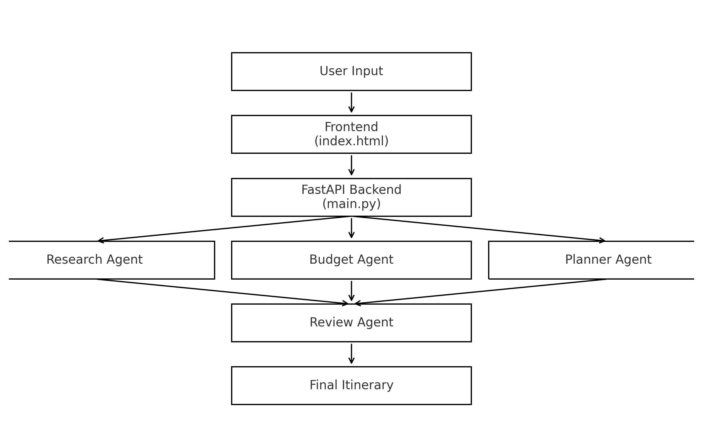
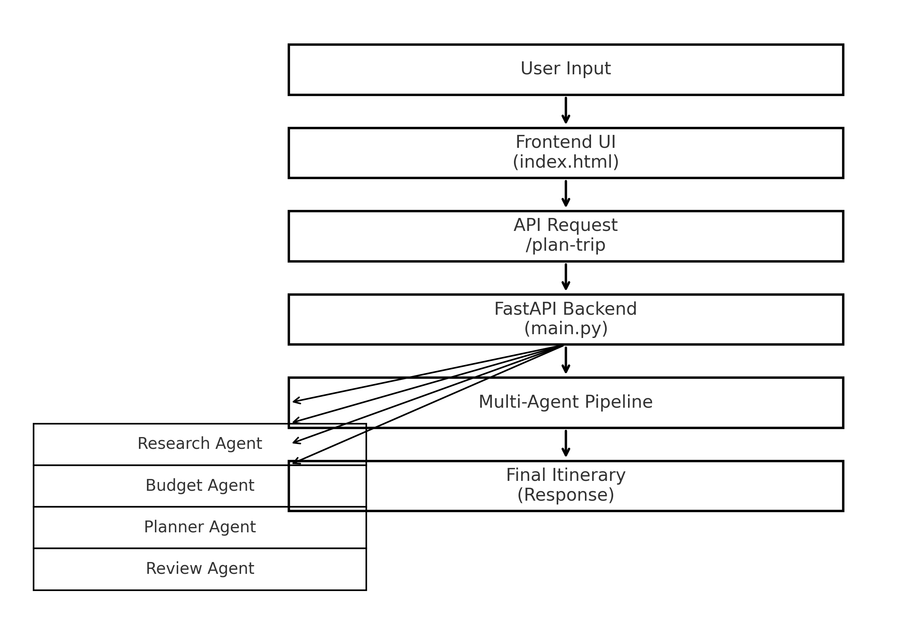

# 📌 INTRODUCTION  
The Smart Travel Planner is an AI-powered multi-agent system designed to generate structured, personalized, and budget-friendly travel itineraries. It analyzes user preferences such as destination, days, interests, and budget to create an optimized trip plan.

---

# 📌 PROBLEM STATEMENT  
Planning a trip is time-consuming and often unorganized. Users face challenges like:
- Selecting destinations based on interests  
- Managing budget effectively  
- Creating day-wise itineraries  
- Adjusting travel plans dynamically  

There is a need for a system that automates travel planning while ensuring personalization, clarity, and cost-effectiveness.

---

# 📌 PROPOSED SOLUTION  
This project introduces a **multi-agent AI system** where each agent performs a specialized task:

- **Planner Agent**: Creates initial itinerary  
- **Validator Agent**: Fixes inconsistencies and ensures budget feasibility  
- **Formatter Agent**: Produces structured JSON output  
- **Refiner Agent**: Enhances clarity and readability  

The system is accessed via a FastAPI backend and a clean frontend interface.

---

# 📌 ARCHITECTURE  
<p align="center">
  
</p>

## 🔹 High-Level Flow  
```
User → Frontend → FastAPI Backend → Multi-Agent System → Final Itinerary
```

## 🔹 Multi-Agent Workflow  
```
[Input] → Planner Agent → Validator Agent → Formatter Agent → Output
```

## 🔹 Folder Structure  
```
project/
APP/
│── main.py
│── planner_agent.py
│
STATICS/
│── index.html
│
README.md
requirements.txt
```

---

# 📌 INSTRUCTION FOR SETUP  

### 🚀 Requirements  
- Python 3.10+
- FastAPI
- Uvicorn
- OpenAI API / Local LLM

### 📦 Installation  
```bash
git clone <your-repo-link>
cd project
pip install -r requirements.txt
```

### ▶️ Run Backend  
```bash
uvicorn main:app --reload --port 8000
```

### 🌐 Run Frontend  
Open `index.html` in browser  
(or use Live Server)

---

# 📌 DIAGRAM  

## 🌐 System Architecture Diagram  
```
+-------------+        +-----------------+        +----------------------+
|   USER      | -----> | FRONTEND (UI)   | -----> | FASTAPI BACKEND     |
+-------------+        +-----------------+        +----------+-----------+
                                                           |
                                                           v
                                                +----------------------+
                                                |  MULTI-AGENT SYSTEM  |
                                                +----------------------+
                                                | Research Agent       |
                                                | Budget Agent         |
                                                | Planner Agent        |
                                                | Review Agent         |
                                                +----------------------+
                                                           |
                                                           v
                                                +----------------------+
                                                |  FINAL ITINERARY     |
                                                +----------------------+
```
## 🧩 System Workflow Diagram
<p align="center">
  
</p>

## 🔄 Multi-Agent Flow Diagram  
```
[User Input]
      |
      v
[Planner Agent] → [Validator Agent] → [Formatter Agent] → [Final JSON Output]
```

---
## 📸 Output Preview

Below is a sample screenshot of the generated travel itinerary from the Smart Travel Planner:

<p align="center">
  
</p>
<p align="center">
  
</p>
---

## 🚀 Live Demo

Try the live application here:

👉 **[Live Link](https://web-production-97b96.up.railway.app/)**

---
